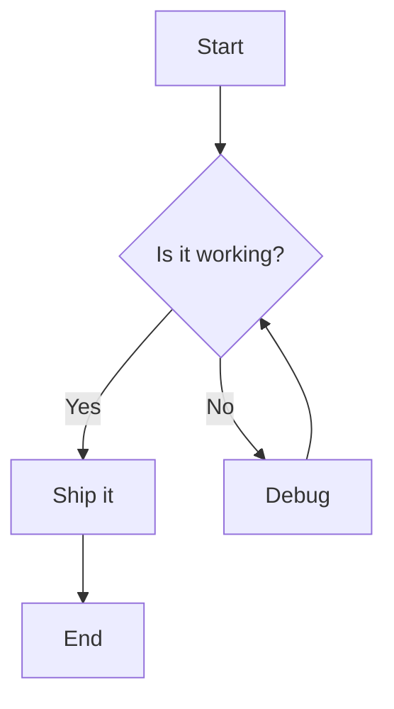
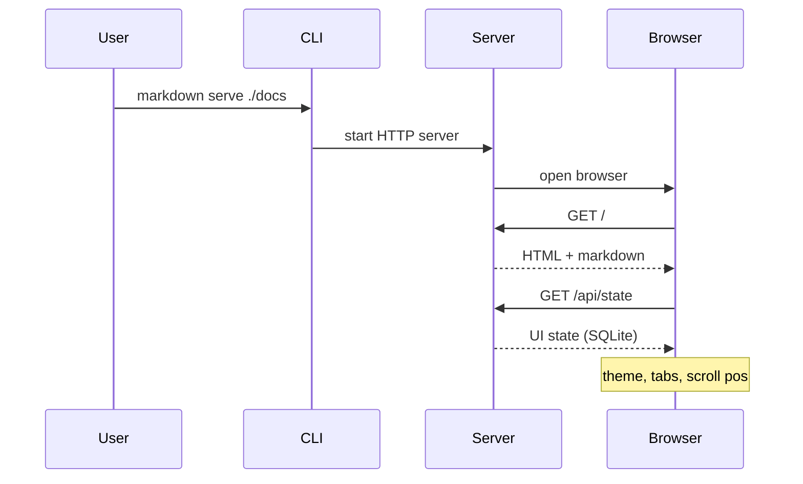
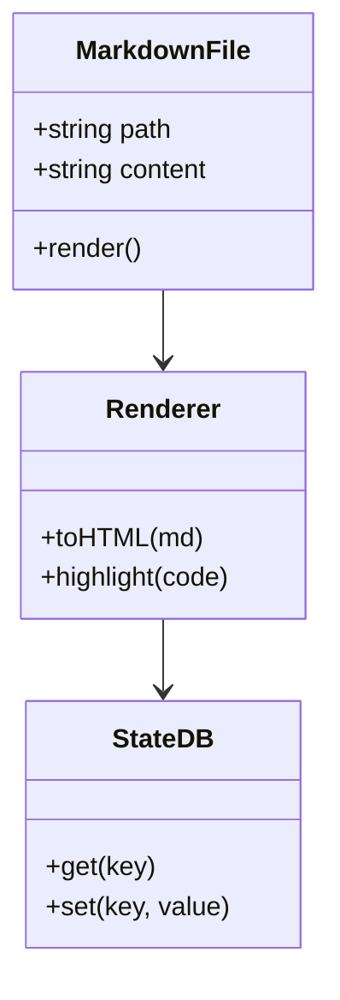
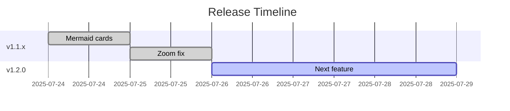
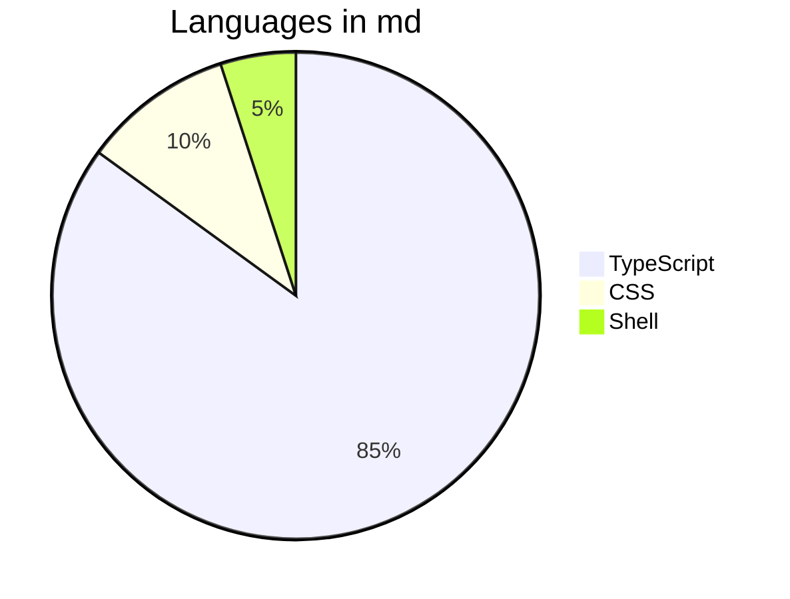
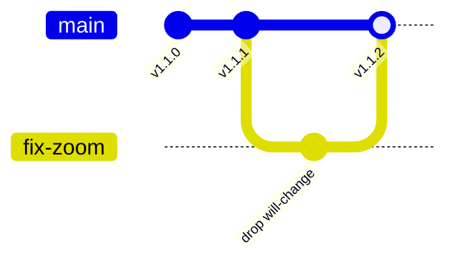

# Diagram Test

Mermaid diagrams to test pan, zoom, fullscreen.

## Flowchart



## Sequence Diagram



## Class Diagram



## Gantt



## Pie



## Git Graph



## Broken (test fallback)

```mermaid
this is not valid mermaid syntax {{{
```

---

# Code Examples

## TypeScript

```typescript
interface DiagramState {
  scale: number;
  tx: number;
  ty: number;
  fitScale: number;
}

class MermaidCard {
  private state: DiagramState;
  private svg: SVGElement;
  
  constructor(private card: HTMLElement) {
    this.svg = card.querySelector('svg')!;
    this.state = { scale: 1, tx: 0, ty: 0, fitScale: 1 };
  }
  
  zoomAt(factor: number, px: number, py: number): void {
    const { scale, tx, ty } = this.state;
    const ns = Math.max(0.1, Math.min(16, scale * factor));
    this.state.tx = px - (px - tx) * (ns / scale);
    this.state.ty = py - (py - ty) * (ns / scale);
    this.state.scale = ns;
    this.apply();
  }
  
  private apply(): void {
    const { scale, tx, ty } = this.state;
    const stage = this.card.querySelector('.mmd-stage') as HTMLElement;
    stage.style.transform = `translate(${tx}px, ${ty}px) scale(${scale})`;
  }
}
```

## Python

```python
import asyncio
from dataclasses import dataclass
from typing import AsyncIterator

@dataclass
class MarkdownFile:
    path: str
    content: str
    
    async def render(self) -> str:
        """Convert markdown to HTML."""
        # Simulate async processing
        await asyncio.sleep(0)
        return f"<div>{self.content}</div>"

async def process_files(paths: list[str]) -> AsyncIterator[MarkdownFile]:
    for path in paths:
        with open(path) as f:
            yield MarkdownFile(path, f.read())

# Usage
async def main():
    files = ["README.md", "CHANGELOG.md"]
    async for md in process_files(files):
        html = await md.render()
        print(f"{md.path}: {len(html)} bytes")

asyncio.run(main())
```

## Rust

```rust
use std::collections::HashMap;
use std::sync::{Arc, Mutex};

#[derive(Debug, Clone)]
struct StateDb {
    inner: Arc<Mutex<HashMap<String, String>>>,
}

impl StateDb {
    fn new() -> Self {
        Self {
            inner: Arc::new(Mutex::new(HashMap::new())),
        }
    }
    
    fn get(&self, key: &str) -> Option<String> {
        self.inner.lock().unwrap().get(key).cloned()
    }
    
    fn set(&self, key: impl Into<String>, value: impl Into<String>) {
        self.inner.lock().unwrap().insert(key.into(), value.into());
    }
}

fn main() {
    let db = StateDb::new();
    db.set("theme", "dark");
    db.set("font", "mono");
    
    if let Some(theme) = db.get("theme") {
        println!("Current theme: {}", theme);
    }
}
```

## Go

```go
package main

import (
	"fmt"
	"sync"
)

type StateDB struct {
	mu   sync.RWMutex
	data map[string]string
}

func NewStateDB() *StateDB {
	return &StateDB{data: make(map[string]string)}
}

func (db *StateDB) Get(key string) (string, bool) {
	db.mu.RLock()
	defer db.mu.RUnlock()
	val, ok := db.data[key]
	return val, ok
}

func (db *StateDB) Set(key, value string) {
	db.mu.Lock()
	defer db.mu.Unlock()
	db.data[key] = value
}

func main() {
	db := NewStateDB()
	db.Set("theme", "dark")
	
	if theme, ok := db.Get("theme"); ok {
		fmt.Printf("Theme: %s\n", theme)
	}
}
```

## SQL

```sql
-- State storage schema
CREATE TABLE IF NOT EXISTS state (
    key TEXT PRIMARY KEY,
    value TEXT NOT NULL,
    updated_at TIMESTAMP DEFAULT CURRENT_TIMESTAMP
);

-- Recent files with position tracking
CREATE TABLE IF NOT EXISTS recent_files (
    path TEXT PRIMARY KEY,
    last_position INTEGER DEFAULT 0,
    last_opened TIMESTAMP DEFAULT CURRENT_TIMESTAMP
);

-- Upsert pattern for state
INSERT INTO state (key, value) VALUES (?, ?)
ON CONFLICT(key) DO UPDATE SET
    value = excluded.value,
    updated_at = CURRENT_TIMESTAMP;

-- Get recent files, capped at 500
SELECT path, last_position FROM recent_files
ORDER BY last_opened DESC
LIMIT 500;
```

## Bash

```bash
#!/usr/bin/env bash
# Install md binary

set -euo pipefail

MD_HOME="${MD_HOME:-$HOME/.md-bin}"
BIN_DIR="${MD_BIN_DIR:-$HOME/.local/bin}"

mkdir -p "$MD_HOME" "$BIN_DIR"

# Download latest release
curl -fsSL "https://github.com/notshekhar/markdown/releases/latest/download/md-$(uname -s | tr '[:upper:]' '[:lower:]')-$(uname -m).tar.gz" \
    | tar -xz -C "$MD_HOME"

# Create symlink
ln -sf "$MD_HOME/markdown" "$BIN_DIR/markdown"
ln -sf "$MD_HOME/markdown" "$BIN_DIR/md"

echo "Installed to $BIN_DIR/markdown"
echo "Run: markdown --version"
```

## JSON

```json
{
  "name": "markdown",
  "version": "1.1.2",
  "description": "Render markdown in terminal or browser",
  "bin": {
    "markdown": "./src/cli.ts",
    "md": "./src/cli.ts"
  },
  "dependencies": {
    "@earendil-works/pi-tui": "0.79.4",
    "chalk": "^5.5.0",
    "highlight.js": "^11.11.1",
    "marked": "^14.1.4",
    "shiki": "^4.2.0"
  }
}
```

## Java

```java
import java.util.concurrent.ConcurrentHashMap;
import java.util.Optional;

public class StateDB {
    private final ConcurrentHashMap<String, String> store = new ConcurrentHashMap<>();
    
    public Optional<String> get(String key) {
        return Optional.ofNullable(store.get(key));
    }
    
    public void set(String key, String value) {
        store.put(key, value);
    }
    
    public static void main(String[] args) {
        var db = new StateDB();
        db.set("theme", "dark");
        db.get("theme").ifPresent(t -> System.out.println("Theme: " + t));
    }
}
```

## C

```c
#include <stdio.h>
#include <stdlib.h>
#include <string.h>

typedef struct {
    char *key;
    char *value;
} Entry;

typedef struct {
    Entry *entries;
    size_t count;
    size_t capacity;
} StateDB;

void db_set(StateDB *db, const char *key, const char *value) {
    if (db->count >= db->capacity) {
        db->capacity = db->capacity ? db->capacity * 2 : 16;
        db->entries = realloc(db->entries, db->capacity * sizeof(Entry));
    }
    db->entries[db->count].key = strdup(key);
    db->entries[db->count].value = strdup(value);
    db->count++;
}

const char* db_get(StateDB *db, const char *key) {
    for (size_t i = 0; i < db->count; i++) {
        if (strcmp(db->entries[i].key, key) == 0) {
            return db->entries[i].value;
        }
    }
    return NULL;
}

int main() {
    StateDB db = {0};
    db_set(&db, "theme", "dark");
    printf("Theme: %s\n", db_get(&db, "theme"));
    return 0;
}
```

## C++

```cpp
#include <iostream>
#include <unordered_map>
#include <string>
#include <optional>
#include <memory>

class StateDB {
    std::unordered_map<std::string, std::string> store;
public:
    void set(std::string key, std::string value) {
        store[std::move(key)] = std::move(value);
    }
    
    std::optional<std::string> get(const std::string& key) const {
        auto it = store.find(key);
        return it != store.end() ? std::optional{it->second} : std::nullopt;
    }
};

int main() {
    auto db = std::make_unique<StateDB>();
    db->set("theme", "dark");
    
    if (auto theme = db->get("theme")) {
        std::cout << "Theme: " << *theme << std::endl;
    }
    return 0;
}
```

## Ruby

```ruby
class StateDB
  def initialize
    @store = {}
    @mutex = Mutex.new
  end

  def get(key)
    @mutex.synchronize { @store[key] }
  end

  def set(key, value)
    @mutex.synchronize { @store[key] = value }
  end
end

# Usage
db = StateDB.new
db.set(:theme, 'dark')
db.set(:font, 'mono')

puts "Theme: #{db.get(:theme)}"
```

## PHP

```php
<?php

class StateDB {
    private array $store = [];
    
    public function get(string $key): ?string {
        return $this->store[$key] ?? null;
    }
    
    public function set(string $key, string $value): void {
        $this->store[$key] = $value;
    }
}

$db = new StateDB();
$db->set('theme', 'dark');
$db->set('font', 'mono');

echo "Theme: " . $db->get('theme') . PHP_EOL;
```

## Swift

```swift
import Foundation

final class StateDB {
    private var store: [String: String] = [:]
    private let queue = DispatchQueue(label: "statedb", attributes: .concurrent)
    
    func get(_ key: String) -> String? {
        queue.sync { store[key] }
    }
    
    func set(_ key: String, _ value: String) {
        queue.async(flags: .barrier) { [weak self] in
            self?.store[key] = value
        }
    }
}

let db = StateDB()
db.set("theme", "dark")
if let theme = db.get("theme") {
    print("Theme: \(theme)")
}
```

## Kotlin

```kotlin
import java.util.concurrent.ConcurrentHashMap

class StateDB {
    private val store = ConcurrentHashMap<String, String>()
    
    fun get(key: String): String? = store[key]
    
    fun set(key: String, value: String) {
        store[key] = value
    }
}

fun main() {
    val db = StateDB()
    db.set("theme", "dark")
    db.set("font", "mono")
    
    db.get("theme")?.let { println("Theme: $it") }
}
```

## Haskell

```haskell
module StateDB where

import qualified Data.Map.Strict as Map
import Data.Map.Strict (Map)

newtype StateDB = StateDB (Map String String)

empty :: StateDB
empty = StateDB Map.empty

get :: String -> StateDB -> Maybe String
get key (StateDB m) = Map.lookup key m

set :: String -> String -> StateDB -> StateDB
set key value (StateDB m) = StateDB (Map.insert key value m)

main :: IO ()
main = do
    let db = set "theme" "dark" empty
    case get "theme" db of
        Just theme -> putStrLn $ "Theme: " ++ theme
        Nothing -> putStrLn "No theme set"
```

## Elixir

```elixir
defmodule StateDB do
  use Agent

  def start_link do
    Agent.start_link(fn -> %{} end, name: __MODULE__)
  end

  def get(key) do
    Agent.get(__MODULE__, &Map.get(&1, key))
  end

  def set(key, value) do
    Agent.update(__MODULE__, &Map.put(&1, key, value))
  end
end

# Usage
{:ok, _pid} = StateDB.start_link()
StateDB.set(:theme, "dark")
theme = StateDB.get(:theme)
IO.puts("Theme: #{theme}")
```

## Clojure

```clojure
(ns state-db.core
  (:require [clojure.core.async :as async]))

(defonce state (atom {}))

(defn get-state [k]
  (get @state k))

(defn set-state! [k v]
  (swap! state assoc k v))

;; Usage
(set-state! :theme "dark")
(set-state! :font "mono")

(println "Theme:" (get-state :theme))
```

## Lua

```lua
local StateDB = {}
StateDB.__index = StateDB

function StateDB.new()
    return setmetatable({store = {}}, StateDB)
end

function StateDB:get(key)
    return self.store[key]
end

function StateDB:set(key, value)
    self.store[key] = value
end

-- Usage
local db = StateDB.new()
db:set("theme", "dark")
print("Theme: " .. db:get("theme"))
```

## Zig

```zig
const std = @import("std");

const StateDB = struct {
    store: std.StringHashMap([]const u8),
    allocator: std.mem.Allocator,

    pub fn init(allocator: std.mem.Allocator) StateDB {
        return .{
            .store = std.StringHashMap([]const u8).init(allocator),
            .allocator = allocator,
        };
    }

    pub fn get(self: *StateDB, key: []const u8) ?[]const u8 {
        return self.store.get(key);
    }

    pub fn set(self: *StateDB, key: []const u8, value: []const u8) !void {
        try self.store.put(key, value);
    }
};

pub fn main() !void {
    var gpa = std.heap.GeneralPurposeAllocator(.{}){};
    const allocator = gpa.allocator();

    var db = StateDB.init(allocator);
    try db.set("theme", "dark");

    if (db.get("theme")) |theme| {
        std.debug.print("Theme: {s}\n", .{theme});
    }
}
```

---

# Wide Tables

## Too Many Columns

| Col1 | Col2 | Col3 | Col4 | Col5 | Col6 | Col7 | Col8 | Col9 | Col10 | Col11 | Col12 | Col13 | Col14 | Col15 | Col16 | Col17 | Col18 | Col19 | Col20 |
|------|------|------|------|------|------|------|------|------|-------|-------|-------|-------|-------|-------|-------|-------|-------|-------|-------|
| A1   | B2   | C3   | D4   | E5   | F6   | G7   | H8   | I9   | J10   | K11   | L12   | M13   | N14   | O15   | P16   | Q17   | R18   | S19   | T20   |
| data | data | data | data | data | data | data | data | data | data  | data  | data  | data  | data  | data  | data  | data  | data  | data  | data  |
| x    | y    | z    | w    | v    | u    | t    | s    | r    | q     | p     | o     | n     | m     | l     | k     | j     | i     | h     | g     |

## Even Wider (25 cols)

| A | B | C | D | E | F | G | H | I | J | K | L | M | N | O | P | Q | R | S | T | U | V | W | X | Y |
|---|---|---|---|---|---|---|---|---|---|---|---|---|---|---|---|---|---|---|---|---|---|---|---|---|
| 1 | 2 | 3 | 4 | 5 | 6 | 7 | 8 | 9 | 10 | 11 | 12 | 13 | 14 | 15 | 16 | 17 | 18 | 19 | 20 | 21 | 22 | 23 | 24 | 25 |

## Long Content Cells

| ID | Name | Description | Status | Created | Updated | Owner | Tags | Priority | Estimate | Actual | Remaining | Dependencies | Blockers | Notes | Links | Attachments | History | Comments | Watchers | Subscribers |
|----|------|-------------|--------|---------|---------|-------|------|----------|----------|--------|-----------|--------------|----------|-------|-------|-------------|---------|----------|----------|-------------|
| 1 | Fix mermaid zoom | The will-change CSS property causes GPU bitmap caching which makes SVG pixelated when scaling | Done | 2025-07-24 | 2025-07-25 | @notshekhar | bug, css, svg, mermaid | P0 | 2h | 1.5h | 0h | #123, #124 | None | Root cause identified in compositing layer | [PR#45](link), [Issue#44](link) | 3 files | 5 commits | 12 comments | 3 watchers | 5 subscribers |
| 2 | Add diagram pan | Implement pointer-based panning for mermaid diagrams with momentum | Done | 2025-07-23 | 2025-07-24 | @notshekhar | feature, ux, interaction | P1 | 4h | 3h | 0h | None | None | Uses Pointer Events API | [PR#43](link) | 2 files | 2 commits | 8 comments | 2 watchers | 3 subscribers |
