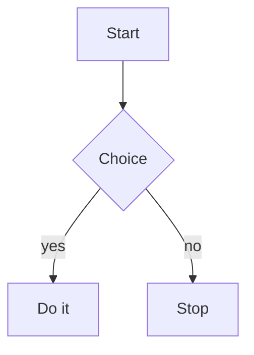

# Markdown Demo

A quick tour of **bold**, *italic*, ~~strike~~, and `inline code`.

## Code

```ts
function greet(name: string): string {
    return `hello, ${name}`;
}
```

## Math

Inline: the area is $A = \pi r^2$ and $E = mc^2$.

Display:

$$\sum_{i=1}^{n} i = \frac{n(n+1)}{2}$$

Greek and roots: $\alpha + \beta \leq \sqrt{x^2 + y^2}$

## Table

| Lang | Year | Cool |
| ---- | ---- | ---- |
| Rust | 2010 | yes  |
| Zig  | 2016 | yes  |

## List

- one
- two
  - nested
- three

> a blockquote with `code`

## Diagram


